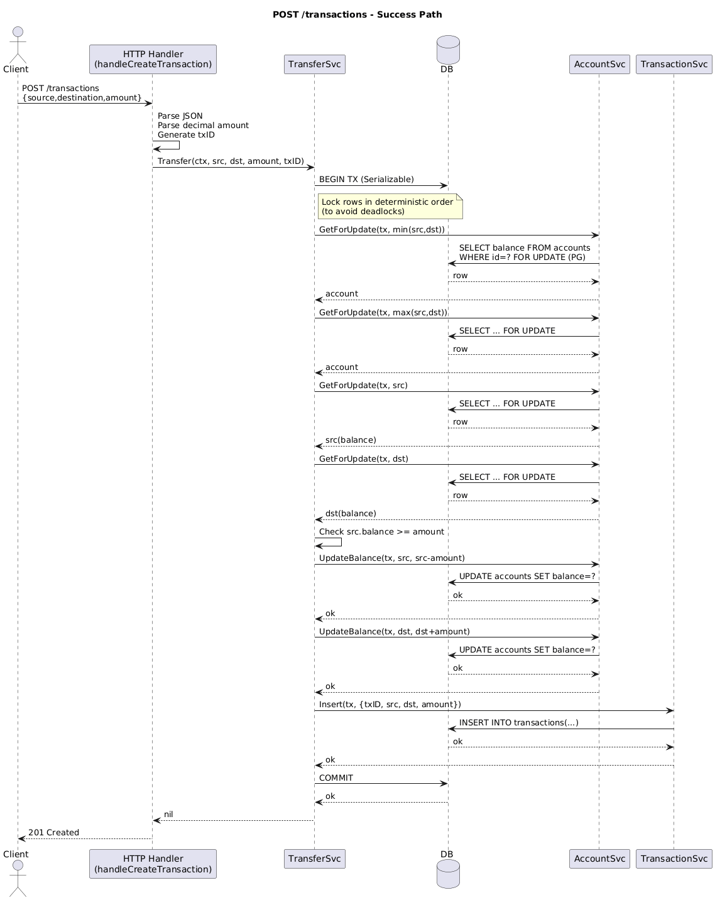
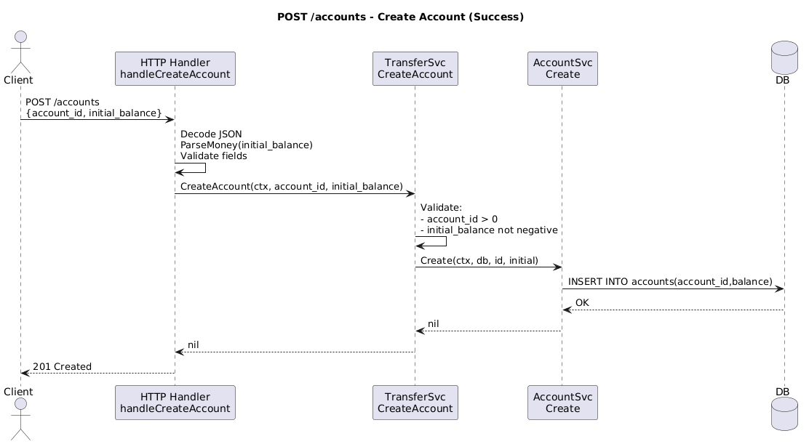

# payments-core
payments-core is the authoritative core ledger service responsible for maintaining account balances and executing atomic transfers.


# Api Flows 
## Transfers API - POST {url}/transactions 
### Functional Requirements
* Idempotency Guarantee 
* Atomicity Guarantee 

### Non-Functional Requirements 
I want to ensure my system has CA (of CAP Theorem)
* highly available
* highly consistent . We dont want the system to have inconsistencies in the data we show to users . **Eventual consistency** is out of question. 
> NOTE : Since this is a sample application I did not emphasize on the cutting edge design decisions , For example I'm taking row lock. this is not an ideal solution in a distributed system . I'd prefer 'redis' for ensuring we guarantee atomicity. 




## Transfers API - POST {url}/accounts 




How to run ?
## On Local
Creating the binary 
```go build  cmd/api/main.go``` 
Running the binary 
```./main```

## On Docker
> Ensure you have docker installed. head here otherwise https://www.docker.com/products/docker-desktop/

```docker-compose up -d --build``` 

# API Test
## Health Check
``` curl -i http://localhost:8080/health ``` 
## Creating account

```bash
curl -i -X POST http://localhost:8080/accounts \
  -H "Content-Type: application/json" \
  -d '{"account_id":1,"initial_balance":"100.00"}'

curl -i -X POST http://localhost:8080/accounts \
  -H "Content-Type: application/json" \
  -d '{"account_id":2,"initial_balance":"25.00"}'
```

## Listing account balance

```bash
curl -s http://localhost:8080/accounts/1
curl -s http://localhost:8080/accounts/2
```

## Create transaction

```bash
curl -i -X POST http://localhost:8080/transactions \
  -H "Content-Type: application/json" \
  -d '{"source_account_id":1,"destination_account_id":2,"amount":"10.50"}'
```